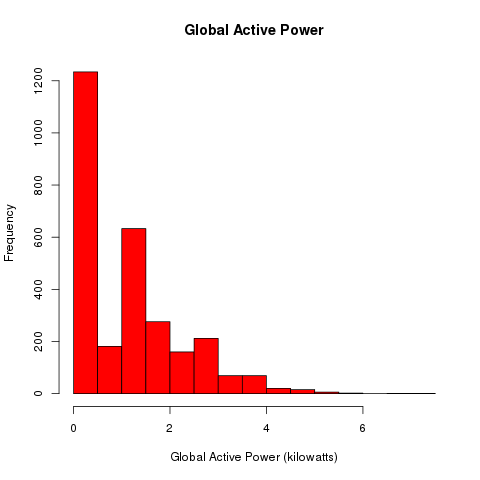
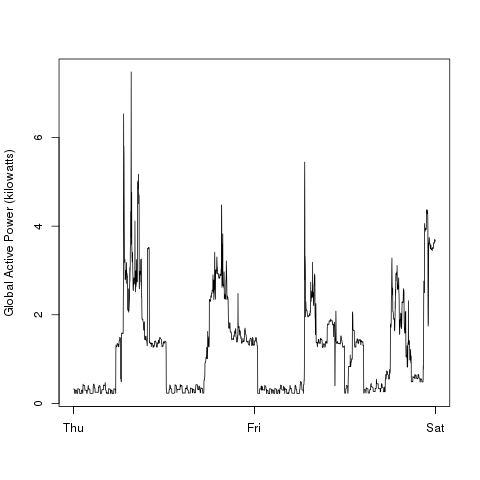
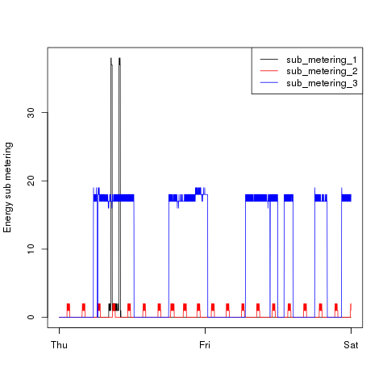
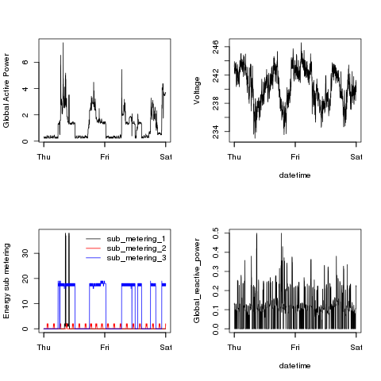

## The graphs

* <b>Dataset</b>: <a href="https://d396qusza40orc.cloudfront.net/exdata%2Fdata%2Fhousehold_power_consumption.zip">Electric power consumption</a> [20Mb]

## Data Processing

I pulled out the 2 days of data we were using with the `head` and `egrep`
commands, which I saved in the makefile's data target.

## Regenerating

First, get the data by running `make data`, then run `make` to generate all the
PNG's.

### Plot 1

### Plot 2

### Plot 3

### Plot 4

